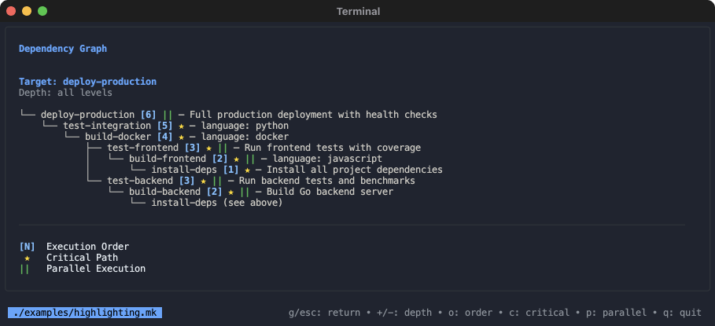
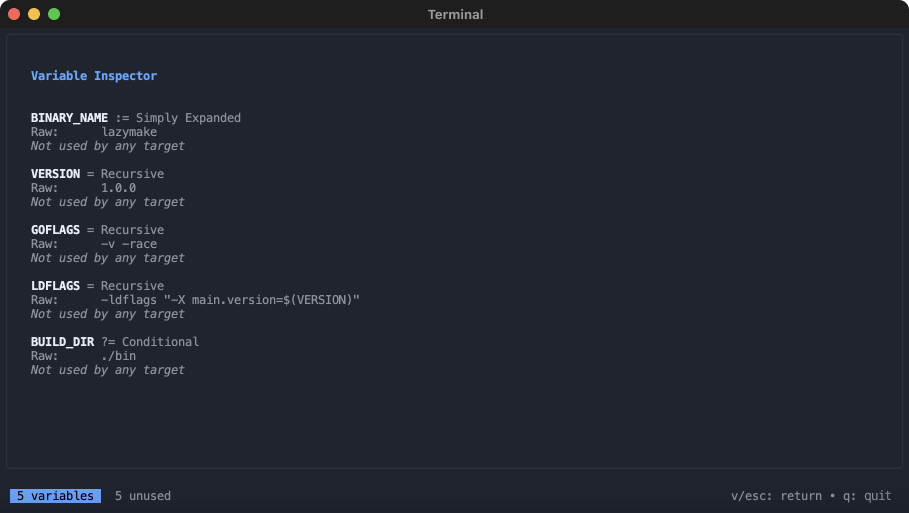
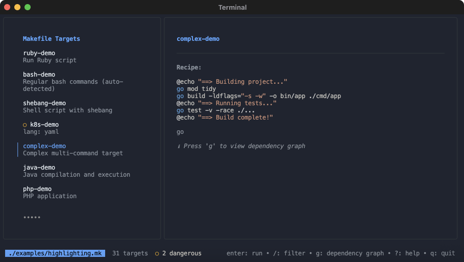
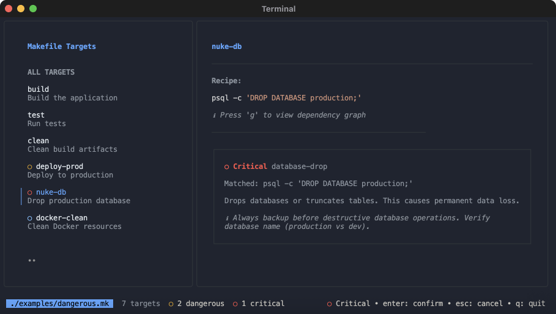
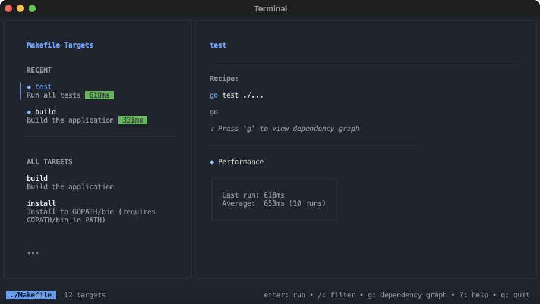
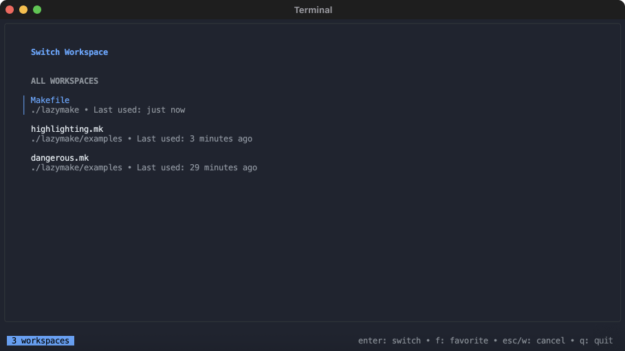

</br>

[](https://github.com/rshelekhov/lazymake/actions/workflows/ci.yml)
[](https://github.com/rshelekhov/lazymake/releases)
[](https://goreportcard.com/report/github.com/rshelekhov/lazymake)
[](https://opensource.org/licenses/MIT)
[](https://github.com/rshelekhov/lazymake/stargazers)

A beautiful terminal user interface for browsing and executing Makefile targets.


## Why lazymake?

**Rant time:** Make is everywhere—19% of top GitHub repos use it—but its UX is stuck in 1976. Want to see available targets? Read the entire Makefile. Trying to understand dependencies? Good luck deciphering that DAG. New to a project? Hope someone documented their Makefile (spoiler: they didn't).

You know the drill: Open Makefile. Scroll through 500 lines. Squint at cryptic tab characters. Wonder what `$(LDFLAGS)` actually expands to. Run the wrong target. Break production. Apologize in Slack.

**There's a better way.** lazymake turns your Makefile into an interactive, visual interface with dependency graphs, variable inspection, safety checks, and performance tracking. Browse targets like you're browsing code. See exactly what will execute before you run it. All with zero configuration.

## Quick Start

**Install:**
```bash
# macOS/Linux (Homebrew)
brew install rshelekhov/tap/lazymake

# Go developers
go install github.com/rshelekhov/lazymake/cmd/lazymake@latest
```

**Run:**
```bash
# In any directory with a Makefile
lazymake

# Or specify a Makefile
lazymake -f path/to/Makefile
```

That's it! No configuration needed. lazymake works with any existing Makefile.

## Features

### Dependency Graph Visualization



See your build structure instantly. lazymake visualizes dependency chains with execution order, critical path markers, and parallel opportunities. Press `g` on any target to understand what will run and when.

**Key features:**
- Execution order numbering - see what runs first
- Critical path highlighting - identify build bottlenecks
- Parallel opportunity markers - speed up builds with `make -j`
- Smart cycle detection - catches circular dependencies

[Full documentation](docs/features/dependency-graphs.md)

### Variable Inspector



Understand your build configuration. lazymake shows all Makefile variables with their raw and expanded values, which targets use them, and whether they're exported to the environment.

**Key features:**
- Full-screen variable browser - press `v` to explore
- Raw vs expanded values - debug variable expansion
- Usage tracking - see which targets use each variable
- Type detection - all assignment operators (=, :=, +=, ?=, !=)

[Full documentation](docs/features/variable-inspector.md)

### Syntax Highlighting for Multi-Language Recipes



Read code faster with automatic syntax highlighting. lazymake detects the language of your recipes (Python, Go, JavaScript, Rust, etc.) and applies appropriate syntax coloring. Works with shebangs, command detection, or manual overrides via comments.

**Key features:**
- Automatic language detection - identifies Python, Go, JavaScript, Rust, and 100+ languages
- Manual overrides - use `# language: python` comments when needed
- Smart detection - recognizes shebangs, command patterns (go, npm, cargo, pip)
- Terminal-optimized colors - monokai-inspired palette for readability

[Full documentation](docs/features/syntax-highlighting.md)

### Dangerous Command Detection



Protect against accidental disasters. lazymake detects dangerous commands (rm -rf, database drops, force pushes, terraform destroy) and requires confirmation before execution. Visual indicators show danger levels with colored circles in the target list.

**Key features:**
- Three severity levels - Critical (red ○), Warning (yellow ○), Info (blue ○)
- Critical commands require confirmation - prevents irreversible mistakes
- Context-aware detection - adjusts severity based on target name and environment
- Detailed warnings in bordered boxes - matched commands, descriptions, and suggestions
- Customizable rules - add project-specific patterns

[Full documentation](docs/features/safety-features.md)

### Recent History & Smart Search



Find targets fast. lazymake tracks your last 5 executed targets per project, showing them at the top for instant access. Real-time search filters by name and description.

**Key features:**
- Recent targets section - your most-used targets on top
- Fuzzy search - press `/` to filter instantly
- Performance regression alerts - spot slow builds
- Per-project history - separate tracking per Makefile

[Full documentation](docs/features/history-search.md)

### Workspace Management



Work with multiple projects seamlessly. Press `w` to see recent Makefiles and automatically discovered ones in your project tree. Star your favorites for quick access.

**Key features:**
- Automatic discovery - finds all Makefiles up to 3 levels deep
- Favorites system - star frequently used projects
- Clear paths - filename in title, full directory path with root in description
- Per-project history - each Makefile remembers its recent targets

[Full documentation](docs/features/workspace-management.md)

### Performance Profiling

Track execution times and catch performance regressions automatically. lazymake stores the last 10 executions per target and alerts you when a target is >25% slower than average.

**Key features:**
- Real-time execution timer - see progress with indicators
- Automatic regression detection - spots slowdowns
- Performance history - tracks avg, min, max durations
- Color-coded duration badges - visual performance indicators

[Full documentation](docs/features/performance-tracking.md)

### Export & Shell Integration

Export execution results to JSON/log files for analysis, or add make commands to your shell history for easy re-running outside lazymake.

**Key features:**
- Multiple export formats - JSON, logs, or both
- Automatic rotation - configurable file limits and cleanup
- Shell integration - bash/zsh history support
- Custom templates - customize command format

[Full documentation](docs/features/export-shell-integration.md)

## Installation

### macOS/Linux (Homebrew)
```bash
brew install rshelekhov/tap/lazymake
```

### Linux (apt)
```bash
# Download the .deb from releases page
wget https://github.com/rshelekhov/lazymake/releases/download/v0.1.0/lazymake_0.1.0_Linux_x86_64.deb
sudo dpkg -i lazymake_0.1.0_Linux_x86_64.deb
```

### Linux (yum/rpm)
```bash
# Download the .rpm from releases page
wget https://github.com/rshelekhov/lazymake/releases/download/v0.1.0/lazymake_0.1.0_Linux_x86_64.rpm
sudo rpm -i lazymake_0.1.0_Linux_x86_64.rpm
```

### Go Developers
```bash
go install github.com/rshelekhov/lazymake/cmd/lazymake@latest
```

### From Source
```bash
git clone https://github.com/rshelekhov/lazymake.git
cd lazymake
make install  # Installs to $GOPATH/bin
```

Or install system-wide:
```bash
make install-system  # Installs to /usr/local/bin (requires sudo)
```

## Usage

```bash
# Run with default Makefile
lazymake

# Specify a different Makefile
lazymake -f path/to/Makefile
```

## Keyboard Shortcuts

| Key | Action | View |
|-----|--------|------|
| `↑/↓` or `j/k` | Navigate | Main list, Output, Workspace picker |
| `Enter` | Execute target | Main list |
| `g` | View dependency graph | Main list |
| `v` | View variable inspector | Main list |
| `w` | Open workspace picker | Main list |
| `?` | Toggle help view | Main list |
| `/` | Search/filter targets | Main list |
| `+/-` | Adjust graph depth | Graph view |
| `o/c/p` | Toggle graph annotations | Graph view |
| `f` | Toggle favorite workspace | Workspace picker |
| `Esc` | Return to previous view | All |
| `q` or `Ctrl+C` | Quit | All |

[Complete keyboard shortcuts reference](docs/guides/keyboard-shortcuts.md)

## Configuration

lazymake works with zero configuration, but you can customize behavior with `.lazymake.yaml`:

```yaml
# Project-specific config (./.lazymake.yaml)
safety:
  enabled: true
  exclude_targets:
    - clean
    - test-cleanup

export:
  enabled: true
  format: json

shell_integration:
  enabled: true
  shell: auto
```

**Configuration file locations:**
- `~/.lazymake.yaml` - Global configuration
- `./.lazymake.yaml` - Project-specific (overrides global)

**Common customizations:**
- [Safety rules](docs/guides/configuration.md#safety-features) - Configure dangerous command detection
- [Export settings](docs/guides/configuration.md#export-configuration) - Control execution result exports
- [Shell integration](docs/guides/configuration.md#shell-integration) - Add commands to shell history

[Full configuration guide](docs/guides/configuration.md) | [Example config](.lazymake.example.yaml)

## Documentation

### Guides
- [Self-Documenting Makefiles](docs/guides/self-documenting-makefiles.md) - Write Makefiles that document themselves
- [Keyboard Shortcuts Reference](docs/guides/keyboard-shortcuts.md) - Complete shortcut guide
- [Configuration Guide](docs/guides/configuration.md) - All configuration options

### Feature Deep Dives
- [Dependency Graph Visualization](docs/features/dependency-graphs.md)
- [Variable Inspector](docs/features/variable-inspector.md)
- [Syntax Highlighting](docs/features/syntax-highlighting.md)
- [Safety Features](docs/features/safety-features.md)
- [Recent History & Smart Search](docs/features/history-search.md)
- [Workspace Management](docs/features/workspace-management.md)
- [Performance Profiling](docs/features/performance-tracking.md)
- [Export & Shell Integration](docs/features/export-shell-integration.md)

[Browse all documentation](docs/)

## FAQ

**Q: Does lazymake work with GNU Make, BSD Make, etc?**
A: Yes! lazymake works with any Make implementation. It parses the Makefile text and executes using your system's `make` command.

**Q: Will this work with my existing Makefile?**
A: Absolutely! No changes required. lazymake reads standard Makefiles. Add `##` comments for better documentation, but it works with any Makefile as-is.

**Q: How do I disable safety checks for trusted targets?**
A: Add `exclude_targets` to your `.lazymake.yaml`. See the [Configuration Guide](docs/guides/configuration.md#safety-features) for details.

**Q: Can I use this in CI/CD?**
A: lazymake is designed for interactive use. For CI/CD, use `make` directly. However, you can use the [export feature](docs/features/export-shell-integration.md) to log execution results for analysis.

**Q: How does lazymake find Makefiles in my project?**
A: Press `w` to scan up to 3 levels deep from your current directory, excluding common directories like `node_modules`, `.git`, etc. See [Workspace Management](docs/features/workspace-management.md) for details.

**Q: Does lazymake modify my Makefile?**
A: Never! lazymake is read-only. It parses your Makefile but never modifies it. All state (history, workspaces, performance data) is stored in `~/.cache/lazymake/`.

## Contributing

Contributions are welcome! Please see [CONTRIBUTING.md](CONTRIBUTING.md) for guidelines.

### Quick Start for Contributors

1. Fork the repository
2. Clone your fork
3. Create a feature branch
4. Make your changes
5. Run tests: `make test`
6. Submit a pull request

## License

MIT License - see [LICENSE](LICENSE) for details.

## Acknowledgments

Built with:
- [Bubble Tea](https://github.com/charmbracelet/bubbletea) - Terminal UI framework
- [Lipgloss](https://github.com/charmbracelet/lipgloss) - Style definitions for terminal UIs
- [Chroma](https://github.com/alecthomas/chroma) - Syntax highlighting library
- [Cobra](https://github.com/spf13/cobra) - CLI framework

Inspired by [lazygit](https://github.com/jesseduffield/lazygit) and [lazydocker](https://github.com/jesseduffield/lazydocker).

---

**Made with ❤️ by developers, for developers.**

Star the repo if lazymake makes your Makefile workflows better!
